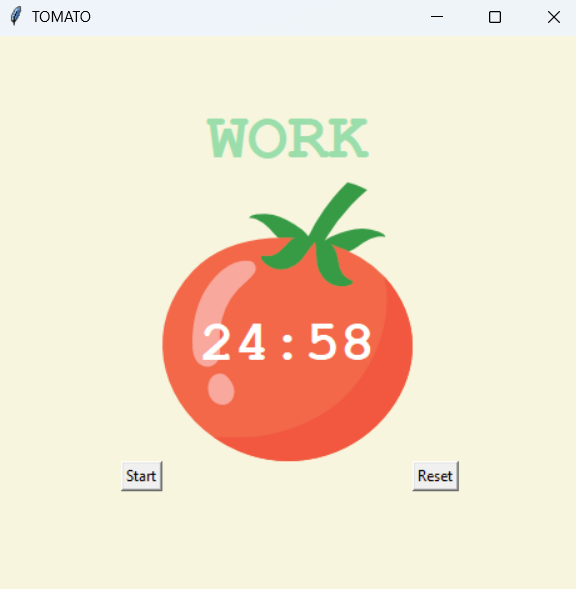
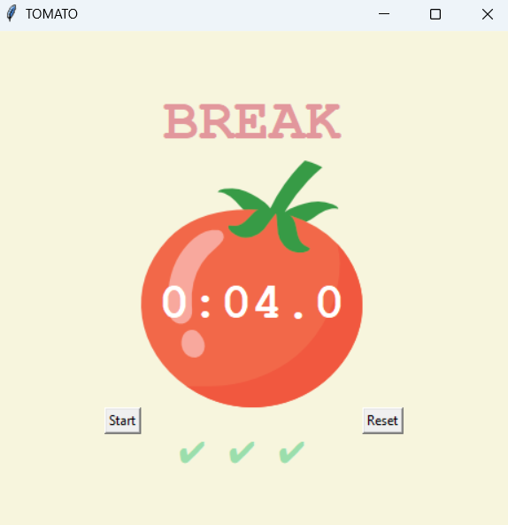

# Pomodoro Timer App

This is a simple Pomodoro Timer application built using Python's Tkinter library. The Pomodoro Technique is a time management method developed by Francesco Cirillo in the late 1980s. The technique uses a timer to break down work into intervals, traditionally 25 minutes in length, separated by short breaks.

## Features

- **Timer Mechanism**: The app follows the Pomodoro Technique by alternating between work intervals and breaks.
- **Customizable Timings**: You can customize the duration of work sessions, short breaks, and long breaks.
- **Visual Feedback**: The app provides visual feedback in the form of changing text colors and checkmarks for completed work intervals.
- **Reset Functionality**: Users can reset the timer at any point to start over.

## How to Use

1. Clone the repository to your local machine.
2. Ensure you have Python installed.
3. Run the `main.py` file using Python.
4. Click the "Start" button to begin the Pomodoro Timer.
5. Click the "Reset" button to reset the timer at any point.

## Screenshots

## Dependencies

- Python 3.x
- Tkinter (usually comes pre-installed with Python)

